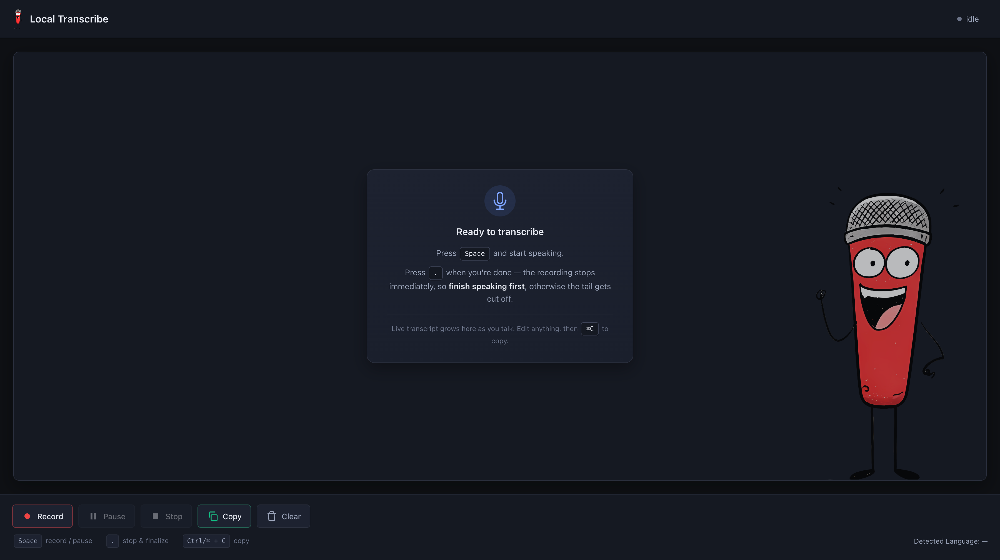

# Local Transcribe



Local-first, browser-based push-to-talk speech-to-text app — runs on **Linux, macOS, and Windows**.
Press <kbd>Space</kbd> → speak → watch the text grow in the textarea → press <kbd>.</kbd> to finalize.

No cloud, no API keys, no telemetry. The backend automatically picks the best local STT engine for your machine: `mlx-whisper` on Apple Silicon (GPU), `faster-whisper` everywhere else (CPU or CUDA).

---

## Features

- **Push-to-talk** — <kbd>Space</kbd> to record/pause, <kbd>.</kbd> to stop & finalize
- **Live transcription** — text grows in the textarea in real time as you speak (~1.5 s updates)
- **Multilingual** — Whisper auto-detects English, German, and 97 other languages
- **Cross-platform** — one codebase runs on Linux, macOS, and Windows
- **Auto backend selection** — Apple Silicon → GPU via mlx-whisper; everything else → faster-whisper (CPU or CUDA)
- **Fully local** — no network calls once the model is downloaded
- **Dark theme**, caret-aware editing, one-click clipboard copy

---

## Architecture

```
Browser (http://localhost:8000)
  │
  │  MediaRecorder → webm/opus chunks every 750 ms
  │  (concatenated in memory before each send)
  │
  └─ WebSocket /ws/transcribe  → complete-so-far webm blob every 1.5 s
                                → server returns {"type":"partial","text":..}
  │
  ▼
FastAPI backend (Python 3.11)
  │
  ├─ macOS Apple Silicon ─►  mlx-whisper large-v3-turbo   (~9× real-time, GPU)
  │
  └─ Linux / Windows / Intel mac
                          ─►  faster-whisper large-v3-turbo (CPU or CUDA)
```

The wire format is identical for every platform — the backend is selected once at startup, fully transparent to the browser.

---

## Quick Start

### 1. Install `uv`

```shell
# macOS / Linux
curl -LsSf https://astral.sh/uv/install.sh | sh            # or: brew install uv

# Windows (PowerShell)
powershell -c "irm https://astral.sh/uv/install.ps1 | iex"
```

### 2. Clone and set up

```shell
git clone https://github.com/iSkrumpie/Local-Transcribe.git
cd Local-Transcribe
python native/run.py setup        # one-time: venv + deps + ~1.5–3 GB model download
```

`setup` automatically detects your platform:
- **Apple Silicon** — installs `mlx-whisper` as well
- **Linux / Windows / Intel mac** — installs only `faster-whisper`

### 3. Start the server

```shell
python native/run.py start        # background daemon
open http://localhost:8000        # macOS; Linux: xdg-open; Windows: start http://localhost:8000
```

| Command | What it does |
|---|---|
| `python native/run.py status` | Is it running? + `/api/health` |
| `python native/run.py logs` | Tail logs (Ctrl+C to exit) |
| `python native/run.py stop` | Stop the daemon |
| `python native/run.py restart` | Reload after code changes |
| `python native/run.py foreground` | Run in foreground (Ctrl+C to stop) |
| `python native/run.py device` | Show which backend will be picked without downloading a model |

Override port: `python native/run.py start --port 9000`

> ℹ️  The legacy `native/run-native.sh` (bash) is kept as a thin wrapper that
> delegates to `run.py` for muscle-memory continuity. Prefer `run.py` —
> it works on Windows too.

---

## Requirements

**All platforms**

- **Python 3.11** (auto-installed by `uv` if missing)
- **`uv`** — Python package & venv manager

**Per-platform backend selection** (automatic — verify with `python native/run.py device`)

| Platform | STT Backend | Extra OS Packages |
|---|---|---|
| **macOS Apple Silicon (M1/M2/M3/M4)** | `mlx-whisper` (GPU) | None |
| **macOS Intel** | `faster-whisper` (CPU) | None |
| **Linux** | `faster-whisper` (CPU or CUDA) | None (CUDA optional — install yourself for GPU accel) |
| **Windows** | `faster-whisper` (CPU or CUDA) | None (CUDA optional — install yourself for GPU accel) |

First run downloads the Whisper model (~1.5–3 GB) into the HuggingFace cache under your home directory.

---

## Tech Stack

| Layer | Choice |
|---|---|
| Web framework | FastAPI + Uvicorn |
| STT (Apple Silicon) | mlx-whisper (Apple MLX port of OpenAI Whisper) |
| STT (Linux/Windows/Intel mac) | faster-whisper (CTranslate2) |
| Whisper model | `large-v3-turbo` (default) — auto-mapped per backend |
| Frontend | Vanilla HTML / CSS / JS |
| Build / venv | uv (Python 3.11) |
| CI | GitHub Actions — Ubuntu, macOS, Windows |

---

## Project Layout

```
.
├── README.md
├── LICENSE
├── .gitignore
├── assets/
│   └── screenshots/
│       └── screenshot.png      # README hero image
├── .github/
│   └── workflows/
│       └── ci.yml               # ruff + mypy + smoke-import on 3 OSes
├── backend/
│   ├── requirements.txt
│   ├── requirements-dev.txt
│   └── app/
│       ├── __init__.py
│       ├── main.py              # FastAPI: routes + WS + static
│       ├── transcriber.py       # Backend factory (auto-pick + swap)
│       ├── backends/
│       │   ├── __init__.py
│       │   ├── base.py          # STTBackend protocol + TranscriptionResult
│       │   ├── mlx_backend.py   # Apple Silicon (mlx-whisper)
│       │   └── fw_backend.py    # CPU/CUDA (faster-whisper)
│       └── static/
│           ├── index.html
│           ├── style.css
│           ├── app.js
│           └── logo.png
├── native/
│   ├── run.py                   # ✅ cross-platform launcher (use this)
│   ├── run-native.sh            # legacy bash wrapper (Linux/macOS)
│   └── .venv/                   # auto-created by `python run.py setup`
└── logs/                        # server.log, server.pid (gitignored)
```

---

## Configuration

All via environment variables — set them before `start` or `foreground`:

| Variable | Default | Notes |
|---|---|---|
| `WHISPER_BACKEND` | `auto` | `auto` picks the best backend; force `mlx` or `fw` |
| `WHISPER_MODEL` | `large-v3-turbo` | Logical name → mapped to the right HF repo per backend |
| `FW_DEVICE` | `auto` | `faster-whisper` only: `cpu`, `cuda`, or `auto` |
| `FW_COMPUTE_TYPE` | `auto` | `faster-whisper` only: `auto`, `int8`, `float16`, … |
| `PORT` | `8000` | HTTP port |

### Logical → physical model mapping

The same logical name expands to different HuggingFace repos per backend:

| Logical | mlx-whisper (Apple) | faster-whisper (cross-platform) |
|---|---|---|
| `large-v3-turbo` *(default)* | `mlx-community/whisper-large-v3-turbo` | `Systran/faster-whisper-large-v3-turbo` |
| `large-v3` | `mlx-community/whisper-large-v3-mlx` | `Systran/faster-whisper-large-v3` |
| `medium.en` | `mlx-community/whisper-medium.en-mlx` | `Systran/faster-whisper-medium.en` |
| `small` | `mlx-community/whisper-small` | `Systran/faster-whisper-small` |
| `tiny` | `mlx-community/whisper-tiny` | `Systran/faster-whisper-tiny` |

Pass a full HF repo id to override the mapping:
`WHISPER_MODEL=Systran/faster-whisper-large-v2 python native/run.py start`.

---

## Performance

| Hardware | Backend | Model | RTFx |
|---|---|---|---|
| MacBook Pro M3 Pro / 18 GB | `mlx-whisper` (GPU) | `large-v3-turbo` | **~8.7×** |
| MacBook Pro M3 Pro / 18 GB | `mlx-whisper` (GPU) | `large-v3-mlx` | ~5.3× |
| Modern x86 CPU (8 cores) | `faster-whisper` (CPU int8) | `large-v3-turbo` | ~0.7× – 1.5× |
| NVIDIA RTX 3060+ | `faster-whisper` (CUDA) | `large-v3-turbo` | ~5× – 10× |

Live-streaming latency with WebSocket (1 s audio chunks): typically **1.3 s – 1.5 s**
end-to-end on Apple Silicon; longer on CPU.

---

## Troubleshooting

### `mlx_whisper` import fails
You need Apple Silicon. `mlx` does not run on Intel Macs or any non-M-series system.
The launcher will automatically fall back to `faster-whisper` — verify with
`python native/run.py device`.

### CUDA on Linux / Windows
Install the CUDA toolkit matching your driver, plus a CUDA-enabled
[ctranslate2](https://github.com/OpenNMT/CTranslate2) build — then
`FW_DEVICE=cuda` unlocks GPU acceleration.

### Port already in use
- **Linux** — the launcher auto-evicts with `fuser -k`. If that fails, stop the
  conflicting process manually or pick a different `--port`.
- **macOS** — same as Linux.
- **Windows** — find the blocker: `netstat -ano | findstr :<port>`, then
  `taskkill /PID <pid> /F`.

### Mic permission denied
Click the mic icon in your browser's address bar, allow, and reload the page.

### Server is slow
- Apple Silicon: try `WHISPER_MODEL=medium.en` (EN-only, much faster)
- CPU: try `WHISPER_MODEL=tiny` (very fast, lower accuracy)
- NVIDIA GPU: see "CUDA on Linux/Windows" above
- First transcription is always slower (model load + warm-up); subsequent ones are fast

### Text in the textarea duplicates
Hard-reload the page (Ctrl/⌘ + Shift + R). The fix is already in place; a stale
cache can sneak duplicates through.

---

## Contributing

Issues and pull requests are welcome. For larger changes, open an issue first so we can discuss the approach. The project uses [Conventional Commits](https://www.conventionalcommits.org/) for commit messages.

---

## License

[MIT](LICENSE) — Copyright (c) 2026 Timm
